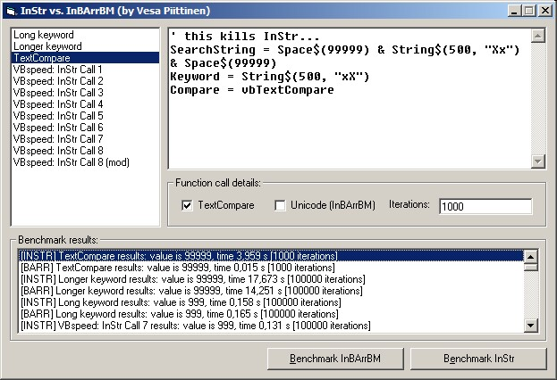



## InBArrBM: byte array searching improved by heaps

### Description

This code makes it possible to search byte arrays. You can search in ANSI (textfiles) or Unicode mode (native VB strings) and the function supports vbTextCompare. The search keyword is passed as a normal string for ease of use. *** This function is somewhat a proof that you can make fast stuff with native VB6 code: with a proper search algorithm even the super fast InStr can be beaten in binary compare! The function uses Boyer-Moore algorithm as its base of searching when keyword is longer than two characters. The function will perform faster if the keyword doesn't change often, as its prosessing speed is heavily based on intelligent keyword indexing. The function will also easily beat InStr when searching for a long keyword within a very long text. The code doesn't use API or TLB to help; it would be possible to increase the speed even further with the help of API and TLB. I didn't want to confuse with the use of those methods. *** The function code is commented so it should be possible to follow how it works. I've spent some time to figure out this function with this much performance, so I hope to get votes - the code should be very useful to anyone who wants to search stuff FAST :)
 
### More Info
 

             |
---                |---
**Submitted On**   |2005-07-15 01:36:48
**By**             |[Vesa Piittinen](https://github.com/Planet-Source-Code/PSCIndex/blob/master/ByAuthor/vesa-piittinen.md)
**Level**          |Advanced
**User Rating**    |4.9 (49 globes from 10 users)
**Compatibility**  |VB 6\.0
**Category**       |[VB function enhancement](https://github.com/Planet-Source-Code/PSCIndex/blob/master/ByCategory/vb-function-enhancement__1-25.md)
**World**          |[Visual Basic](https://github.com/Planet-Source-Code/PSCIndex/blob/master/ByWorld/visual-basic.md)
**Archive File**   |[InBArrBM\_\_1913517152005\.zip](https://github.com/Planet-Source-Code/vesa-piittinen-inbarrbm-byte-array-searching-improved-by-heaps__1-61710/archive/master.zip)

